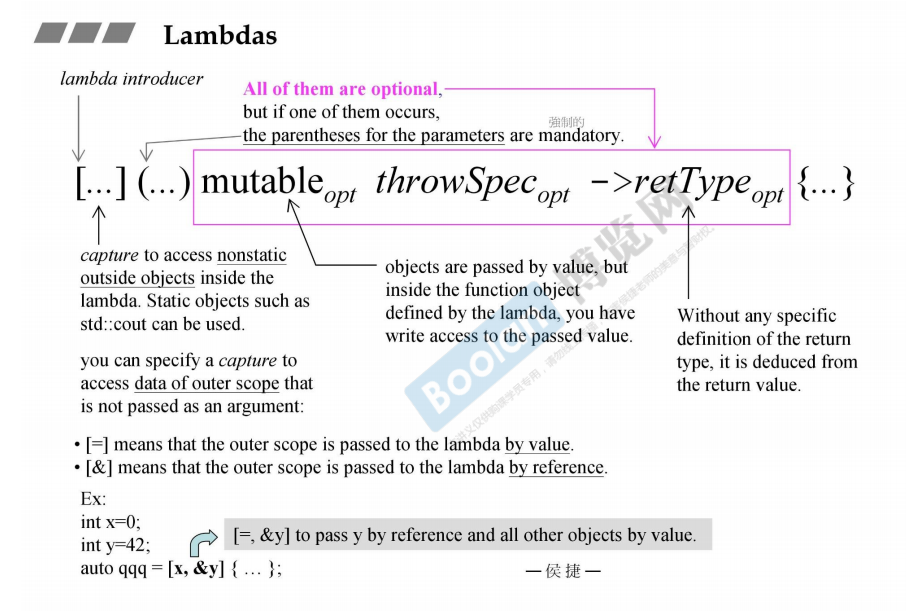
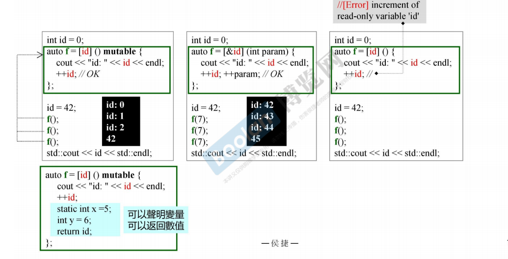
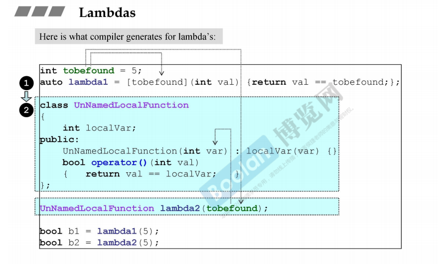
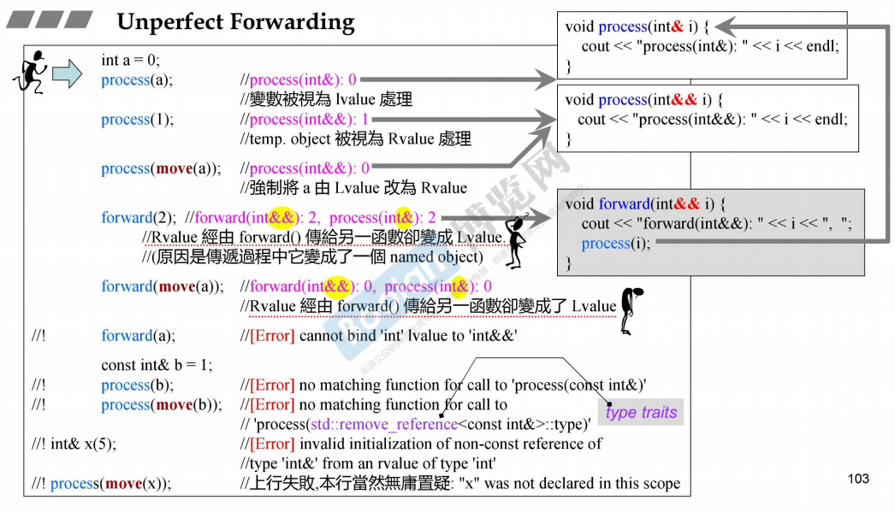
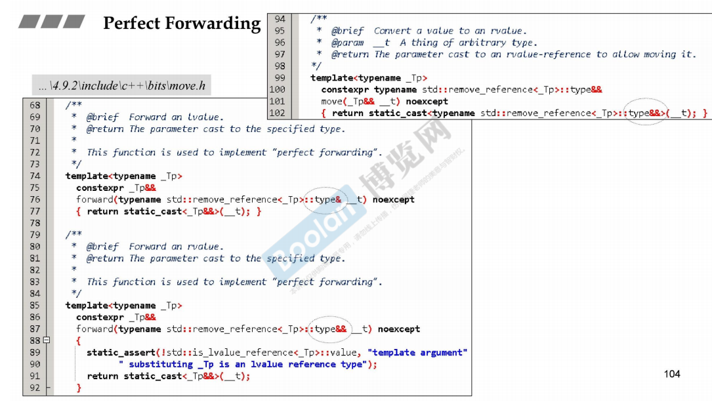
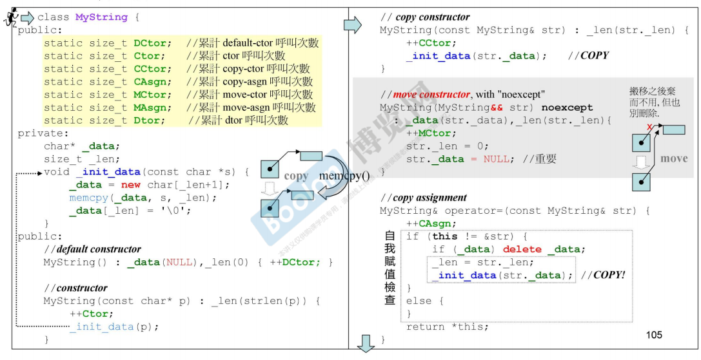
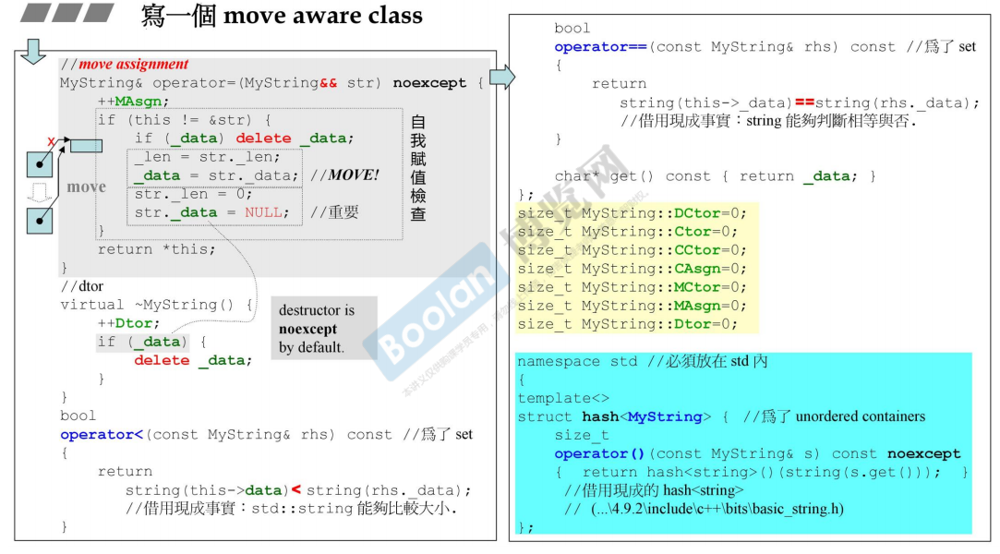
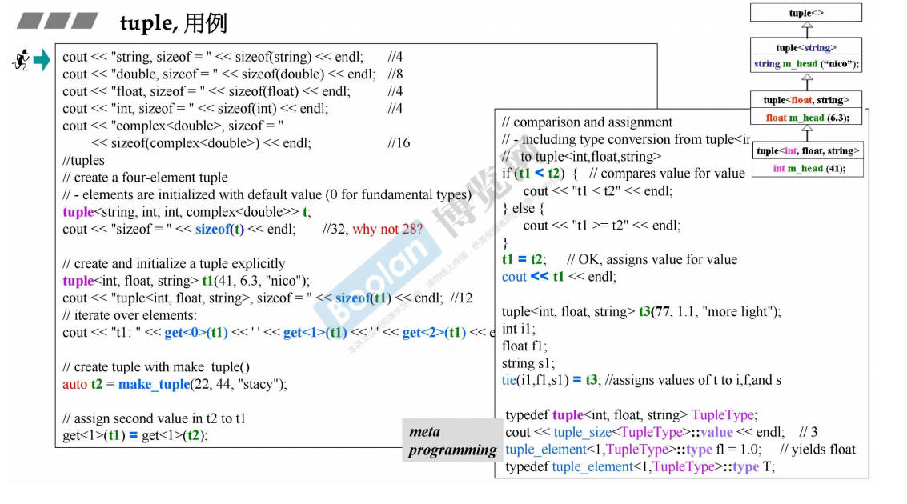

# Variadic Templates

## 例一

```C++
void printX(){}		// 1

template <typename T,typename... Types>
void printX(const T& firstArg, const Type&... args)
{
    cout << firstArg << endl;
    printX(args...);
}					//2
```

…就是一个所谓的pack（包），

用于template parameters，就是template parameters pack（模板参数包）；

用于template parameter types，就是template parameter types pack（模板参数类型包）；

用于function parameters，就是function parameters pack（函数参数包）

**sizeof…(args)可以知道args里有多少arguments**

```C++
template <typename... Types>
void printX(const Type&... args)	//3
```

**此函数可以和上述函数二并存，并且相比于前文的函数二更泛化，即函数二更特化**

## 例二

**使用 variadic templates 重写 printf()**


## 例三

 若参数types皆同，无需动用variadic template，使用initializer_list\<T\>足矣


## 例四


## 例五


要特殊处理首尾元素就要知道有几个元素（ sizeof…() ）和正在处理第几个元素


递归的创建，再调用

## 例六

递归的继承（使用TUPLE），使用 class template

```C++
template<typename Head, typename... tail>
class tuple<Head, Tail...>
: private tuple<Tail...>
{
    typedef tuple<Tail...> inherited;
protected:
    Head m_head;
public:
    tuple(){}
    tuple(Head v, Tail... vtail): m_head(v),inherited(vtail...){}	//注意这是initialize list
    
    //typename Head::type head(){return m_head;}
    auto head() -> decltype(m_head){return m_head;}
    //或者是改成Head head() {return m_head;}也可以
    inherited& tail() {return *this;}	//尾部传回自己并转型为inherited，获得的就是下面图片中的灰色框框中的部分
    
};
```


## 例七

递归复合


# Spaces in Template Expressions

```C++
vector<list<int>>;	// c++11可以这么写，1.0不行
```

# nullptr and std::nullptr_t

 C++11 let you use **nullptr** instead of **0 or NULL** to specify that a pointer refers to no value

```C++
void f(int);
void f(void*);

f(0); //f(int)
f(nullptr);	//f(void*)
```

nullptr 的 type 是 std::nullptr_t，在头文件<cstddef>中有定义 

#auto

```C++
list<string> c;
list<string>::iterator ite;
ite = find(c.begin(), c.end, target);

auto ite = find(c.begin(), c.end(), target);

auto i = 42; //i has type int
auto l = [](int x)->bool{...}	//lambda表达式
```

# Uniform Initialization

Initialization could happen with parentheses, braces, and/or assignment operators.

```C++
//共通性初始化 大括号
int val[]{1, 2, 3};
vector<int> v{2, 3, 4, 5, 6};
vector<string> cities{"qwe", "hello world", "London"};
complex<double> c{4.0, 3.0};
```

编译器看到大括号就会做出一个initializer_list\<T\>, 关联到一个array\<T, n\>

调用函数时该array内元素可被编译器分解逐一传给函数。

# Initializer list

```C++
int i;			//没有初始化
int j{};		//初值为0
int* p;			//没有初始化
int* q{};		//初值为nullptr
int x1{5.3};	//x1 == 5;
int x2 = 5.3;	//x2 == 5;
int x3{5.0};	//error
int x4 = {5.3};	//error
char c1{7};		//it's ok
char c2{99999};	//error
std::vector<int> v1{3,4,5}	//it's ok
std::vector<int> v2{3,4,5.1}//error
```

initializer_list\<\>

```C++
void print(std::initializer_list<int> vals){
    for(auto p = vals.begin(); p != vals.end(); ++p){
        std::cout << *p << "\n";
    }
}
print({12,3,5,7,11,13,17});
```

# explicit

explicit for ctors taking more than one argument

原本的explicit是阻止编译器调用 **non-explicit-one-argument-ctor** 的

```C++
explicit P(int a, int b, int c){...}	//A
P(int a, int b){...}					//B
P(initializer_list<int>){...}			//C

void fp(const P&){...};
```

```C++
P p1 (1, 2);			//B
P p2 {1, 2};			//C
P p3 {1, 2, 3};			//C
P p4 = {1, 2};			//C
P p5 = {1, 2, 3};		//ERROR
P p6 (1, 2, 3);			//A

fp({1, 2});				//C
fp({1, 2, 3});			//ERROR
fp(P{1, 2});			//C
fp(P{1, 2, 3});			//C

P p11 {1, 2, 3, 4};		//C
P p12 = {1, 2, 3, 4};	//C
P p13 {1};				//C
```

# ranged-base for

```C++
for(decl : coll){
    statement
}

==>
for(auto _pos = coll.begin(), _end = coll.end(); _pos != _end; ++_pos){
    decl = *_pos;
    statement
}

for(auto _pos = begin(coll), _end = end(coll); _pos != _end; ++_pos){
    decl = *_pos;
    statement
        
    //其中的begin()和end()都是全局函数
}
```


EG >

```C++
for(int i:{2, 3, 5, 7, 9, 13, 17, 19}){
    cout << i << endl;
}

vector<double> vec;
for(auto elem : vec){
    cout << elem << endl;
}
for(auto& elem : vec){
    elem *= 3;
}
```

# =default, =delete

如果你自行定义了一个ctor，编译器就不会再给你一个 default ctor。

如果你强制加上=default，就可以重新获得并使用 default ctor

```C++
class Zoo{
    public:
    Zoo(int i1, int i2): d1(i1), d2(i2){};
    Zoo(const Zoo&) = delete;
    Zoo(Zoo&&) = default;					//右值引用，move ctor
    Zoo& operator=(const Zoo&) = default;
    Zoo& operator=(const Zoo&&) = delete;	//搬移赋值
    virtual ~Zoo() {};
    
    private:
    int d1, d2;
};
```

copy ctor/copy assign不能被overloaded，所以写了一份copy ctor/copy assign后就不能对copy ctor/copy assign使用=default或者=delete

析构函数不能 =delete

**一个类只要带有pointer member，就肯定需要自己写出Big-Three（ctor，copy ctor，copy assign，dtor）**

 

# Alias Template（template typedef）

 ```C++
 template <typename T>
 using Vec = std::vector<T, MyAlloc<T>>;
 
 Vec<int> coll;	//std::vector<int, MyAlloc<int>> coll;
 ```

Alias Template 没有特化/偏特化 

# Template template parameter

模板参数

```C++
template< typename T, 
		  template<class> 
              class Container
        >
class XCLs{
private:
    Container<T> c;
    
public:
    XCLs(){
        for(long i = 0; i < SIZE; ++i)
            c.insert(c.end(), T());
        
        output_static_data(T());
        Container<T> c1(c);
        Container<T> c2(std::move(c));
        c1.swap(c2);
    }
}

template<typename T>
using Vec = vector<T, allocator<T>>;

template<typename T>
using Lst = list<T, allocator<T>>;

template<typename T>
using Deq = deque<T, allocator<T>>:

XCLs<MyString, Vec> c1;
XCLs<MyStrNoMove, Vec> c2;

XCLs<MyString, Lst> c1;
XCLs<MyStrNoMove, Lst> c2;

XCLs<MyString, Deq> c1;
XCLs<MyStrNoMove, Deq> c2;
```

# Type Alias

```C++
using func = void(*) (int, int);
//typedef void(*func)(int, int);
using value_type = T;
//typedef T value_type;
```

# noexcept

```C++
void foo() noexcept;
```

一定不会丢出异常

```C++
void swap(Type& x,Type& y)noexcept(noexcept(x.swap(y))){
    x.swap(y);
}
```

x.swap(y)不丢出异常，则该函数不会丢出异常

# override

覆写virtual函数

```C++
struct Base{
    virtual void vfunc(float){}
};
struct Derived1: Base{
	virtual void vfunc(int){}  
};
struct Derived2: Base{
	virtual void vfunc(int) override{}  //报错
    virtual void vfunc(float) override{}
}
```

主要功能是告知编译器这个函数是覆写的而不是重载的，以便编译器检查传入的参数是否有误，如果错误就直接报错

# final

```C++
struct Base1 final{};
struct Derived1: Base1{};	//ERROR,final指继承链的最后，不希望有其他class继承自final

struct Base2{
    virtual void f() final;
};
struct Derived2: Base2{
    void f();	//ERROR,final指此函数不希望被覆写(override)
}
```

# decltype

By using the new decltype keyword, you can let compiler find out the type of an expression

```C++
map<string, float> coll;
decltype(coll)::value_type elem;
```

## declare return types

```C++
template<typename T1,typename T2>
decltype(x+y) add(T1 x, T2 y);
```

```C++
template<typename T1, typename T2>
auto add(T1 x, T2 y)->decltype(x+y);	//新的函数返回类型的指定方式
```


## use in metaprogramming

在模板里的各种运用 

```C++
template<typename T>
void test_decltype(T obj){
    map<string, float>::value_type elem1;
    map<string, float> coll;
    decltype(coll)::value_type elem2;
    
    //有了decltype就可以这么写
    
    typedef typename decltype(obj)::iterator iType;
    //typedef typename T::iterator iType;
    
    decltype(obj) anotherObj(obj);
}
```


## pass the type of lambda

```C++
auto cmp = [](const Person& p1, const Person& p2){
    return p1.lastname()<p2.lastname()||(p1.lastname()==p2.lastname()&&p1.firstname()<p2.firstname());
};

std::set<Person, decltype(cmp)> coll(cmp);
```

# Lambda

语法：`[...](...)mutable  throwSpec -> retType {...}`

```C++
[]{
    std::cout << "hello lambda" <<std::endl;
} ();	//表面上是声明了一个函数，实际上是一个functor，在写完后后面加上一个小括号表示调用它

//另一种声明+调用方式
auto I = []{
    std::cout << "hello lambda" <<std::endl;
};

I();
```



```C++
int id = 0;
auto f = [id]()mutable{
    cout << "id: " << id << endl;
    ++id;
};
id = 42;
f();
f();
f();

cout << id << endl;

/**
 * id: 0
 * id: 1
 * id: 2
 * 42
 */
```

==>等效于

```C++
class Functor{
private:
    int id;		//copy of outside id
public:
    void operator() (){
        cout << "id: " << id << endl;
        ++id;
    }
};

Functor f;
```





# Rvalue reference and Move Semantics

Rvalue reference are a new reference type that help solve the problem of unnecessary copying and enable perfect forwarding. **When the right-hand side of an assignment is an rvalue, then the left-hand side object can steal resources from the right-hand side object can steal resources from the right-hand side object rather than performing a separate allocation,** thus enabling move semantics

什么是unnecessary copying？

一些临时对象要push/insert到容器当中去会执行copy动作，比如vector成长会进行copy动作，这些可能都是unnecessary copying

Lvalue：可以出现在operator= 左侧者

Rvalue：只能出现在operator= 右侧者

**临时对象就是一个右值**

```C++
int foo() {return 5;}
int x = foo();		//ok
int* p = &foo();	//[ERROR]对Rvalue取其reference，不可以
foo() = 7;			//[ERROR]
```

当Rvalue出现于operator=（copy assignment）的右侧，我们认为对其资源进行move而非copy是可以的，合理的

**则必须要有语法让我们在调用端告诉编译器：这是一个Rvalue**

**则必须要有语法让我们在被调用端写出一个专门处理Rvalue的所谓move assignment函数**


# Perfect Forwarding



forword到process的调用是不完美的转接 



## 写一个 move aware class





 

# Tuple



