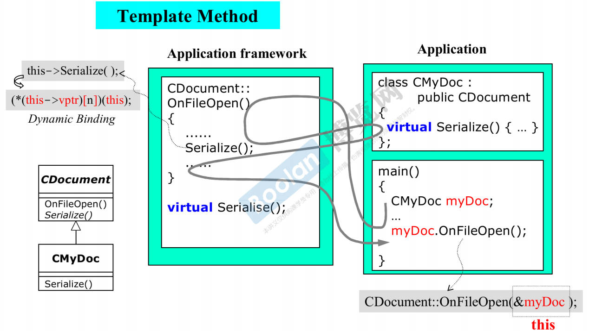
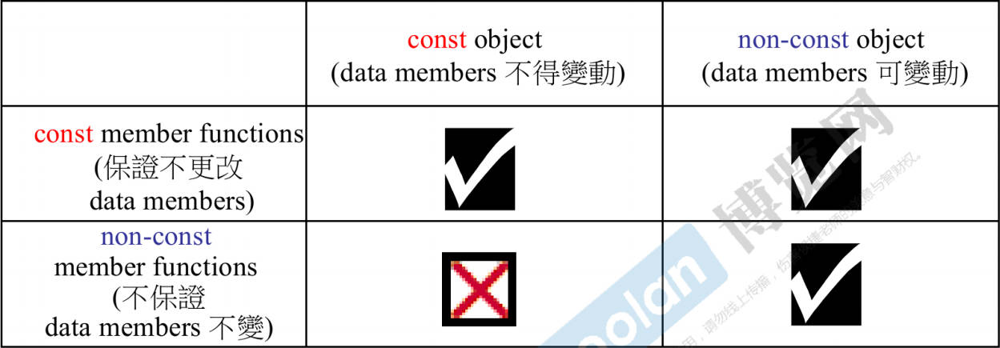
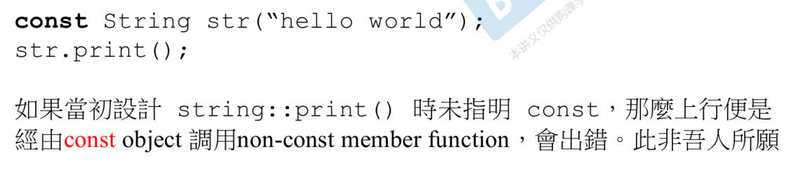

# 基础部分

## new和delete的使用

```c++
int *p = new int(5);  
delete p;

int *p = new int[N];
delete[] p;
```

## const与 *

```c++
int* const p = &x;	//p为常指针，固定指向变量x，不能让其指向其他变量，但p指向变量的内容是可以改变的。
int const *p = &x; //则/p为指向常量的指针，p指向变量的内容不可改变，但p指向的变量可以改变。
*指向常量的常指针：
int const * const p = &x; //则/p为指向常量的常指针，p指向的变量和内容都不能改变。
```


\* 在const前面pointer是常量，const在 \* 前面data是常量

## C-style String

### 字符数组

```c++
char a[10] = {'C','+','+'};
char a[10] = {"C++"}; //字符串赋值，后面会自动加'\0'
```

```C++
//输入一整行内容
cin.getline(字符数组名,数组长度,结束标记);
```

**注意：若指定参数“字符个数”为n，则利用cout函数输出时只显示字符数组中的前n-1个字符。**

**原因：字符数组的第n个字符是不可见字符'\0'**

**当第三个参数省略时，系统默认为'\0'**

### 字符指针

三种方式

```C++
char* p1 = "hello";
char s[10] = "hello";
char *p2 = s;
char *p3 = new char[20];
```

## 函数重载的一些细节

函数重载是只看函数签名不同，函数签名包括**参数的种类，个数或者顺序。函数后面的const关键字也属于签名**

注意，**返回类型**不属于函数签名，**可变参数列表**也不是函数重载的标志，因为它们可以与不定数量的参数一起使用

# 面向对象

## 基本语法

```C++
//定义类
class Base
{
    private:
    	int aa;
    public:
    	int bb;
    	Base(int a,int b,int c){aa = a; bb = b; cc = c;}
    	Base(Base&);
    	~Base();
    protected:
    	int cc;
    	void f();
}
//定义类方法
void Base::f(){
    cout << "hello world" << endl;
}
//定义构造函数
Base::Base(int a,int b,int c){
    aa = a; bb = b; cc = c;
}
Base::Base(Base& X){
    aa=X.aa;
    bb=X.bb;
    cc=X.cc;
}
//定义对象
Base b;
Base* pb;
Base*p = &b;
//调用方法
b.f();
pb->f();
(*p).f();
//初始化对象
Base a(1,2,3);
Base b = a;
Base c(a);
```

## 静态数据成员与函数

```C++
public:
static void showCount()
{ cout << count << endl;}  //静态成员函数，用于输出count
private:
static int count;         //静态数据成员
...
int Point::count=0;      //类外初始化
以下是主函数：
Point a(4,5);
Point::showCount();   //count=1
Point b(a);
Point::showCount();   //count=2
```

```c++
static void total_show()   //静态成员函数，用来输出总重量和总数 
	{
		cout<<"已卖出"<<total_weight<<"斤西瓜"<<endl;
		cout<<"已卖出"<<total_number<<"个西瓜"<<endl;
	}
};
double WaterMelon::total_weight = 0.0; //静态数据成员的初始化 
int WaterMelon::total_number = 0;      //注意用类名限定 

```

## 友元

### 友元函数

声明：在类里声明

`friend 数据类型 函数名(参数);`

注意：定义时不需要加friend关键字。

### 友元类

若A类为B类的友元类，则A类的所有成员函数都是B类的友元函数。

**注意以下几点：①友元关系不能传递。②友元关系是单向的。③友元关系无法继承。**

```C++
//声明友元类
class B{
    friend class A;
};
```

## 常类型

### 常对象

```C++
类名 const 对象名; 
const 类名 对象名;
```

**注意：定义常对象时必须进行初始化，此后该对象不能再被更新。**

### 常数据成员

```C++
类名(参数表):数据成员(形参名){}

Test(int i):x(i){}
```

### 常成员函数

```C++
类型说明符 成员函数名(参数表) const;//const放在最后
```

## 派生类

```c++
class 派生类名 : 继承方式 基类名
{   private:
    public:
    protected:
};
```

### 构造函数

可以在构造函数中直接传入基类

```C++
class Base
{
    public:
    int a;
    int b;
    Base(int aa,int bb);
};
class Child : public Base
{
    public:
    bool c;
    Child(const Base& B, bool h);
    Child(int a,int b,bool h)
}
Base::Base(int aa,int bb){
    a = aa;
    b = bb;
}
Child::Child(const Base& B, bool h):Base(B) //初始化列表
{ 
    c = h;
}
Child::Child(int a, int b, bool h):Base(a, b) //初始化列表
{ 
    c = h;
}
```

### 虚函数

派生类重写的函数，一般需要在析构函数前加virtual

### 静态联编和动态联编

由于函数重载，编译器需要查看函数参数才能决定使用哪个函数。

将源代码中的函数调用解释为特定执行的函数代码块称为函数名联编。

编译过程中联编称为静态联编（static binding），由于虚函数，编译时无法确定，编译器必须能够在程序运行时选择正确的虚方法代码，被称为动态联编（dynamic binding）。

### upcasting和downcasting

将派生类引用或指针转换为基类引用或指针被称为向上强制转换（upcasting）

反之则成为向下强制转换（downcasting）

### 虚基类与多重继承

当出现一个类继承多个类时，需要虚基类出场


要进行如图所示的继承关系编写，需要注意以下几点：

1.   Singer和Waiter都继承自Worker，所以对象实例中都含有一个Worker对象

2.   由于SingingWaiter同时继承了Singer和Waiter，如果按照一般语法书写，SingingWaiter类中会含有两个Worker，为避免这一点，SInger和Waiter继承Worker时需要加virtual关键字称为虚基类。

     

     ```C++
     class Worker{};
     class Singer : public virtual Worker{};
     class Waiter : virtual public Worker{};
     //注意virtual的位置不影响
     class SingingWaiter : public Singer, public Waiter{};
     
     ```

3.   这其中一般不需要Worker的实例，所以可以把Worker写成一个抽象基类（所有virtual函数后加 = 0）


## 基类与派生类的赋值兼容

1.   派生类的对象可以赋值给基类对象

2.   派生类的对象可以初始化基类的引用(基类对象可以作为派生类对象的别名)

3.   派生类对象的地址可以赋给指向基类的指针


>   例如，B是A的派生类，b是B的对象，a是A的对象
>
>   ```C++
>   a = b;  // 注意不是b=a！
>   A &aa = b;
>   pa = &pb;
>   ```

## 运算符重载

### 基本语法

```C++
class Time{
    public:
    Time operator+ (const Time& t) const; //重载加法运算符
}

total = coding.operator+(fixing);   //function notation
total = coding + fixing;   //operator notation

 Vector operator-() const;  //负号的重载
```

其中第一个参数时调用operator运算符重载的参数，第二个参数时传入的参数

### 无法重载的运算符

 

### 只能通过成员函数进行重载的运算符

1.   =：赋值运算符
2.   ()：函数调用运算符
3.   []：下标运算符
4.   ->：通过指针访问类成员的运算符

### 友元与运算符重载

非成员函数的运算符重载必须声明为友元函数

```C++
Time operator*(double n);
Time t,a;
t = a * 1.5;	//valid
t = 1.5 * a;	//invalid
friend Time operator*(double m, const Time& t);
t = 1.5 * a; 	// ==> t = operator(1.5,a);
```


### ++与--的重载

前置++i

重载为成员函数：`i.operator++( )`

重载为友元函数：`operator++(i)`

后置i++

重载为成员函数：`i.operator++(int)  //int通常为0`

重载为友元函数：`operator++(i,int)`

**这类运算符前置时与一般的单目运算符重载方式相同，但是后置时形参表会多一个参数int(一般为0)用来区分是前置还是后置**

### >>运算符重载

```C++
friend ostream &operator<<(ostream &os, const Vector &v);
```

<<或者>>需要返回一个ostream/istream对象进行cout或cin操作


## conversion function

>转换函数
>
>>侯捷C++ 面向对象下P2

```C++
class Fraction {
public:
  Fraction(int num, int den = 1) : m_numerator(num), m_denominator(den){};
  operator double() const { return (double)(m_numerator / m_denominator); }

private:
  int m_denominator;
  int m_numerator;
};
```

其中operation doouble 就是一个转换函数，将Fraction类转换为double

```C++
Fraction f(3,5);
double d = 4 + f;	//调用operation double()将f转为0.6
```

## non-explicit-one-argument ctor

>   转换函数
>
>   >   侯捷C++ 面向对象下P3

```C++
class Fraction {
public:
  Fraction(int num, int den = 1) : m_numerator(num), m_denominator(den){};
  Fraction operator+(const Fraction& f){
      return Fraction(...)
  }

private:
  int m_denominator;
  int m_numerator;
};
```

```C++
Fraction f(3,5);
double d = f + 4; //调用non-explicit ctor 将4转为Fraction(4,1),然后调用operator+
```

如果加上

```C++
operator double() const { return (double)(m_numerator / m_denominator); }
```

下面的操作会产生歧义，可以调用operator double，也可以调用operator+，所以无法编译

此时应该在Fraction的构造函数前加关键字explicit

```c++
explicit Fraction(int num, int den = 1) : m_numerator(num), m_denominator(den){};
```

此时编译器不会把4变成fraction(4,1)，只有明确调用Fraction构造函数是才会使用，不会隐性调用构造函数

## 继承，复合与委托（Inheritance, Composition and Delegation）

### 复合——has-a


比如queue中含有deque就是复合

构造函数先执行component，再执行自己。析构函数则反之

### 继承——is-a


构造函数先执行base class，再执行自己。析构函数则反之

### 委托：composition by reference

**Pimpl：Pointer To Implementation**

类中有指向其他类的指针。

包含这个指针的类只是一个对外的接口，真正地实现全部在指针所指的类中

## vptr和vtbl


对于继承中含有的虚指针和虚函数表。虚函数在每个类中都含有一个virtual pointer指向自己在virtual function table中的地址


图片中`(*(p->vptr)[n])(p)`或者`(*p->vptr[n])(p)`对应上面p所在的箭头顺序调用，叫做动态绑定（dynamic binding）

## 关于this和dynamic binding



图中Application framework的OnFileOpen函数中调用的Serialize函数是virtual函数，所以此时需要进行动态绑定，可以发现是Derived类在调用Base类继承的方法，所以此时的Serialize方法应该调用CMyDoc类而非CDocument类的方法

**动态绑定的几个条件：1.通过指针调用	2.调用的是虚函数    3.发生向上转型**

# 模板

##函数模板

```C++
template<类型参数表>
返回值类型 函数名(函数参数表)
{
    函数体
}
```

*Eg*

```C++
template<typename T>
T max(T x,T y){
    return(x > y) ? x : y;
}
```

##类模板

```C++
template<模板参数表>
class 类模板名{
    类成员声明
};

template<模板参数表>
返回值类型 类模板名<模板参数顺序表>::成员函数名(函数参数表){函数体}

定义模板类对象：
    类模板名<类模板实参表> 对象名(构造函数实参表);

```

## 成员模板

类模板中有成员也需要模板——典型例子：STL pair

```C++
template <class T1,class T2>
struct pair{
    typedef T1 first_type;
    typedef T2 seconde_type;
    T1 first;
    T2 second;
    
    template<class U1,class U2> 
    pair(const pair<U1,U2>& p)
    	:first(p.first),second(p.second){};	//pair的复制构造函数 
}
```

*Eg*

```C++
pair<Derived1, Derived2> p;
pair<Base1, Base2> p2(p);

pair<Base1,Base2> p2(pair<Derived1, Derived2>());
```

## 模板特化——Specialization

```C++
template <class T> class ABC{};
template<> class ABC<char>{};	//如果指定的类型的是char，就调用这里的成员定义
```

## 模板偏特化——Partial specialization

### 个数上的偏特化

```C++
template <typename T,typename Alloc = ....>
class vector{
    ...
};
template<typename,Alloc = ....>
class vector<bool, Alloc>{...};
```

### 范围上的偏特化

```C++
template <typename T>
class C{...};
template <typename T>
class C<T*>{...};	//特化指针类型
```

## 模板模板参数——template template parameter

>这个有点抽象

```C++
template<typename T, template<typename T>class Container>
class XCLs{
private:
    Container<T> c;
public:
    ...
};

//使用
template<typename T>
using Lst = list<T, allocator<T>>;	//C++2.0语法

XCLs<string, list>mylst1;	//这里无法编译成功，因为list等标准库需要第二参数分配器，且直接使用默认赋值
XCLs<string, Lst> mylst2;
```

## Variadic template (C++11)

模板参数数量不定

```C++
template<typename T,typename... Types>
void print(const T& firstArg,const Types&...args)	//调用者传入的参数分为一个和一包
{
    cout << firstArg << endl;
    print(args...);
}
```

**…**就是所谓一个pack（包）

用于 template parameters，就是 template parameters pack

用于 function parameter types，就是 function parameter types pack

用于 function parameters，就是 function parameters pack

操作符**`sizeof...(args)`**会展示有包里多少个参数

# 文件流

需要包含头文件`<fstream>`

## 写文件

1.包含头文件 

```C++
#include<fstream>
```

2.创建流对象 

```C++
ofstream ofs;
ifstream ifs
```

3.打开文件 

```C++
ofs.open("文件路径",打开方式);
```

4.写数据 

```C++
ofs << "写入的数据";
```

5.关闭文件 

```C++
ofs.close();
```

**<a href="./code/fstream.cpp" title="fstream.cpp">关于文件流fstream的示例代码（看得懂就ok）</a>**

# IO流以及相关方法

##  istream类方法

### cin.get()和 >>

```C++
cin.get(char &);
char = cin.get(void);
```

两者都可以接收空格或者换行符，而cin>>ch不能接收空格和换行符

*Eg*

```C++
char ch;
int ct = 0;
cin.get(ch);	    //或者ch = cin.get()
while (ch != '\n') {
    cout << ch;
    ct++;
    cin.get(ch);	//或者ch = cin.get()
}
cout << endl;
cout << ct << endl;

in	 hello world
out  hello world
     11
```

```C++
char ch;
int ct = 0;
cin >> ch; 
while(ch != '\n')
{
	cout << ch;
	ct++;
	cin >> ch; 
}
cout << ct << endl;

in 	hello world
out helloworld 并且无法通过换行退出程序
```


### getline(),get()和ignore()

```C++
istream & get(char*, int, char);
istream & get(char*, int);
istream & getline(char*, int, char);	//第一个参数作为接收的字符串，第二个参数作为最多接收的字符个数，第三个参数作为停止接受的标志，缓冲区中会删除接收到的第三个参数
istream & getline(char*, int);			//没有第三个参数默认以换行符结束
```

*Eg.以下程序，输入与对应的输出结果如下*

```C++
#include <iostream>
using namespace std;
const int Limit = 255;
int main()
{
	char input[Limit];

	cout << "Enter a string for getline() processing: " << endl;
	cin.getline(input, Limit, '#');  
	cout << "Here is your input: " << endl;
	cout << input << endl;
	cout << "-------------------------" << endl;

	char ch;
	cin.get(ch);
	cout << "The next input character is: " << ch << endl;

	cin.ignore(Limit, '\n');	//忽略掉缓冲区剩余的Limit个字符，遇到‘\n’时结束

	cout << "------------------------" << endl;
	cout << "Enter a string for get() processing " << endl;
	cin.get(input, Limit, '#');
	cout << "Here is your input: " << endl;
	cout << input << endl;
	
	cin.get(ch);
	cout << "The next input character is: " << ch << endl;

	return 0;
}
```

```C++
Enter a string for getline() processing:
hello world#good morning
Here is your input:
hello world
-------------------------
The next input character is: g
------------------------
Enter a string for get() processing
hello world#good morning
Here is your input:
hello world
The next input character is: #	//此处使用get没有在缓冲区中删除接收到的第三个参数
```

### peek()和putback()

peek()调用形式为cin.peek()，返回值是一个**char类型**的字符，其返回值是指向指向的当前字符，如果要访问的字符是文件结束符，则函数值是**EOF(-1)**。
但只是做观测使用，即**指针仍停留在当前位置**，并不后移。其功能是从输入流中读取一个字符，但该字符并未从输入流中删除。
**若把输入流比作一个队列，那么peek()函数相当于队列的成员函数front()，而cin.get()则相当于队列的成员函数pop()。**

```C++
char ch;
while (cin.peek() != '#') {
	cin.get(ch);
	cout << ch;
}
cout << endl;
if (!cin.eof()) {
    cin.get(ch);
    cout << ch << " is next input character." << endl;
} else {
    cout << "End of input reached." << endl;
    exit(0);
}
```

```
输入：hello world#good morning
输出：hello world
	 # is next input character.
输入：hello world
输出：hello world [EOF]
	 End of input reached.
```


putback()函数调用形式为**cin.putback(ch)**，其作用是将前面用get或者getline函数从输入流中读取的字符ch返回到输入流，插入到当前指针的位置，供后面读取。

```C++
char ch;

while(cin.get(ch))
{
	if(ch != '#')
		cout << ch;
	else
	{
		cin.putback(ch);	//因为此时‘#’字符不在缓冲区里，使用putback函数返回回来
		break;
	}
}
cout << endl;
if(!cin.eof())
{
	cin.get(ch);
	cout << ch << " is next input character." << endl;
}
else
{
	cout << "End of input reached." << endl;
	exit(0);
}
```

```
输入：hello world#good morning
输出：hello world
	 # is next input character.
输入：hello world
输出：hello world [EOF]
	 End of input reached.
```


两者不同在于peer函数根本没取出#字符，而putback是取出后又放回去

**<a href="./code/truncate.cpp" title="truncate.cpp">关于peer和putback的示例代码（看得懂就ok）</a>**

# 类型转换

>   《Effective C++》条款27

## C-Style casting

`(T) expression`

## Function style casting

`T (expression)`

## C++ Style casts

```C++
1. const_cast <T> (expression)
```

**cast away the constness** ：用来将对象的常量性移除，只有const_cast能做到这一点

```C++
2. dynamic_cast <T> (expression)
```

**safe downcasting** ：安全向下转型，比如从父类指针转化到子类指针，运行开销较大

```C++
3. reinterpret_cast <T> (expression)
```

低级转型

```C++
4. static_cast <T> (expression)
```

**implicit conversions** ：强迫隐式转换

*Eg.*

```C++
class Widget{
    public:
    explicit Widget(int size);
    ...
};
void doSomework(const Widget& w);
doSomework(Widget(15));				   //函数风格转型
doSomework(static_cast<Widget>(15));	//C++ style转型
```

*Eg.*

```c++
int x,y;
double d = static_cast<double> (x)/y;
```


这个转型动作建立的是一个**\*this对象所指的，其中base class的这部分**。上述代码并非在当前对象身上调用Window::onResize之后又在该对象上执行SpecialWindow专属动作。他是在当前对象的base class的部分的**副本**上调用Window::onResize。所以如果你想让SpecialWindow的对象执行Window::onResize，应该这么写：

```C++
class SpecialWindow: public Window{
    public:
    virtual void onResize(){
        Window::onResize();	//调用Window::onResize作用于*this身上
    }
}
```

# Pointer like classes和Function like classes

## Pointer like classes——智能指针

```C++
template<class T> class shared_ptr{
    public:
    T& operator*() const{return *px;}
    T* operator->() const{return px;}
    shared_ptr(T* p):px(p){}
    
    private:
    T* px;
    long* pn;
    //...
};

//使用
struct A{
    //...
    void method(void);
};
shard_ptr<A> sp(new A);
A f(*sp);		//得到 *px
sp->method();	//sp->会得到px，此时由于->符号特性，作用之后不会消失，会继续作用与px，所以该语句相当于px->method();
```

C++标准库中的实例：iterator（迭代器）

```C++
reference operator*() const{return (*node).data;}
pointer operator->() const{return &(operator*());}
```


## Function like classes

```C++
template<class T>
struct identity{
    const T& operator() (const T& x) const {return x;}
}
```

重载  () 运算符


# const

## const 成员函数和const object



const member function: `void f(int, double) const`,在function的声明或者定义后写了const



*Eg*


# new 和 delete 的步骤和重载

## new和delete的步骤

### new：先分配memory，再调用ctor

```C++
Complex* pc = new Complex(1,2);

编译器会转化为:
void* mem = operator new(sizeof(Complex));	//分配内存:内部调用malloc(n)
pc = static_cast<Complex*> (mem);			//转型
pc->Complex::Complex(1,2)					//构造函数
```

### delete：先调用dtor，再分配memory

```C++
delete pc;

编译器转化为:
Complex::~Complex(pc);		//析构函数
operator delete(pc);		//释放内存：内部调用free(pc)
```

## operator new和operator delete的重载

**可以用于内存池设计**

# STL与泛型编程

>   *侯捷STL标准库与泛型编程课程笔记*

STL六大部件：Allocator（分配器），Container（容器），Algorithm（算法），Iterator（迭代器），Functor（仿函数），Adapter（适配器）

## OOP与GP

OOP(Object-Oriented programming)和GP(Generic Programming)的区别在于**OOP企图将data和method关联在一起**，而**GP将data和method分开**（container和algorithm）

## Container（容器）的使用

Container分为下面几类：Sequence Container，Associative Container，Unordered Container

### Sequence Container

#### Array：定长数组

####Vector：不定长数组

>clear() 清空  
>front()/back()  第一个/最后一个数
>push_back()/pop_back()  
>begin()/end() 迭代器
>支持随机寻址
>支持比较运算，按照字典序来比较

####Deque：双端队列	=>	Queue：队列，Stack：栈

>Deque
>
>>clear()
>>size()
>>empty()
>>back()/front()            返回第一个/最后一个元素
>>push_back()/pop_back()    向队尾插入/弹出队尾
>>push_front()/pop_front()  向队首插入/弹出队首
>>[]                        随机选取
>>begin()/end()             迭代器
>
>Queue 
>
>>   push()     向队尾插入一个元素
>>   pop()      弹出队头元素
>>   front()    返回队头元素
>>   back()     返回队尾元素
>>   没有clear()函数
>
>Stack
>
>>push()  向栈顶插入一个元素
>>top()   返回栈顶元素
>>pop()   弹出栈顶元素
>>没有clear()函数

####List：双向链表	=>	Forward-List：单向链表

### Associative Container

**实现方式：红黑树 RB-Tree**
>支持size，empty，clear,begin()/end()迭代器以及++,--

####Set/Multiset：集合

>set不能有重复元素,multiset可以有
>insert() 插入一个数
>find()   查找一个数,不存在返回end()迭代器
>count()  返回某个元素的个数
>erase()
>
>>   输入一个数x，删除所有x    O(k+logn)
>>   输入一个迭代器，删除这个迭代器
>
> lower_bound()/upper_bound()   不存在均返回end()
>   
>>       lower_bound(x) 返回大于等于x的最小的数的迭代器
>>       upper_bound(x) 返回大于x的最小的数的迭代器

####Map/Multimap：键值对

>insert()  插入的是一个pair
>erase()   输入的参数是pair或迭代器
>find()
>[]        访问键值对,时间复杂度 O(log n)
>lower_bound()/upper_bound()


### Unordered Container

**实现方式：哈希表 HashTable（用链表解决冲突）**

#### Unordered Set/Multiset

和上面类似，增删改查的时间复杂度是O(1)
不支持lower_bound/upper_bound,以及迭代器的++,--

#### Unordered Map/Multimap

和上面类似，增删改查的时间复杂度是O(1)
不支持lower_bound/upper_bound,以及迭代器的++,--

## 分配器Allocator

### operator new()和malloc()

malloc()提供的的比你所需的一般会大。

### Allocator

#### VC6


#### BC5


#### GCC2.9


GCC还有自己独有的allocator，并且所有容器的默认都使用的是Alloc

## Container的实现


**注意：所有容器实现上都是前闭后开**

### List

**基于G2.9**

```C++
template <class T>
struct __list_node{
    typedef void* void_pointer;
    void_pointer prev;
    void_pointer next;
    T data;
};

template<class T, class Ref, class Ptr>
struct __list_iterator{
    typedef T value_type;
    typedef Ptr pointer;
    typedef Ref reference;
    ...
}

template<class T, class Alloc = alloc>
class list{
protected:
    typedef __list_node<T> list_node;
public:
    typedef list_node* link_type;
    typedef __list_iterator<T, T&, T*> iterator;
protected:
    link_type node;
...
}
```


**图示结构**


**复合关系**

#### List's Iterator

```C++
template <class T>
struct __list_node{
    typedef void* void_pointer;
    void_pointer prev;
    void_pointer next;
    T data;
};

template<class T, class Ref, class Ptr>
struct __list_iterator{
    typedef __list_iterator<T, Ref, Ptr> self; 
    typedef bidirectional_iterator_tag iterator_category;
    typedef T value_type;
    typedef Ptr pointer;
    typedef Ref reference;
    typedef __list_node<T>* link_type;
    typedef ptrdiff_t difference_type;
    
    link_type node;
    reference operator*() const { 
        return (*node).data;
    }
    
    pointer operator->() const { 
        return &(operator*());
    }
    
    self& operator++() { 
        node = (link_type)((*node).next);	
        //node为下图中绿色字体的部分，通过typedef追溯可知，node就是双向链表的一个结点的指针
        return *this;		//return by reference，不会唤起ctor等成员函数
    }
    
    self operator++(int){	//后++加入参数以区分，参数无意义
        self tmp = *this;	//记录原值，注意，*不会唤起operator*，而是先调用=赋值符号使用copy ctor。创建tmp并以*this为初值
        ++*this;			//进行操作
        return tmp;			//返回原值，return by value，唤起copy ctor
    }
    ...
};
```


### Vector

**自动扩充的数组**

扩充方式：每次size==capacity时，就会进行扩充，扩充后的大小为原来的两倍


```C++
template<class T,class Alloc = alloc>
class vector{
public:
    typedef T			value_type;
    typedef value_type* iterator;	//T*
    typedef value_type& reference;
    typedef size_t		size_type;
protected:
    iterator start;
    iterator finish;
    iterator end_of_storage;
public:
    iterator begin(){ return start;}
    iterator end(){ return finish;}
    size_type size() const{
        return size_type(end() - begin());
    }
    size_type capacity() const{
        return size_type(end_of_storage - begin());
    }
    bool empty() const{return begin() == end();}
    reference operator[](size_type n){return *(begin() + n);}
    reference front() { return *begin();}
    reference back() { return *(end() - 1);}
}; 
```

#### push_back函数


#### Vector’s Iterator

```C++
template<class T, class Alloc = alloc>
class vector{
public:
    typedef T value_type;
    typedef value_type* iterator;
    ...
}
```

### Deque


deque实现连续的方式是分段连续，含有一个控制中心和对于每一段的迭代器，迭代器前往下一个时必须检查是不是这一段的最后一个数据，如果是的话就需要回到控制中心找到下一段的开头

```C++
template <class T, class Alloc = alloc, size_t BufSiz = 0>
class deque{
public:
    typedef T value_type;
    typedef __deque_iterator<T, T&, T*, BufSiz> iterator;
protected:
    typedef pointer* map_pointer;	//T**
protected:
    iterator start;
    iterator finish;
    map_pointer map;
    size_type map_size;
public:
    iterator begin() {return start;}
    iterator end() {return finish;}
    size_type size() const {return finish - start;}
...  
};


```

#### deque’s iterator

```C++
template<class T, class Ref, class Ptr, size_t BufSiz>
struct __deque_iterator{
    ...
    typedef T** map_pointer;
    typedef __deque_iterator self;
    
    T* cur;
    T* first;
    T* last;
    map_pointer node
}
```

#### deque\<T>::insert()

```C++
iterator insert(iterator position, const value_type& x){
    if(postion.cutr == start.cur){
        push_front(x);
        return start;
    }
    else if(position.cur == finish.cur){
        push_back(x);
        iterator tmp = finish;
        --tmp;
        return tmp;
    }
    else {
        return insert_aux(position, x);
    }
}

template<class T, class Alloc, size_t BufSize>
typename deque<T, Alloc, BufSize>::iterator
deque<T, Alloc, Bufsize>::insert_aux(iterator pos, const value_type& x){
    difference_type index = pos - start;	//安插点之前的元素个数
    value_type x_copy = x;
    if(index < size() / 2){				//如果前面的元素更少
        push_front(front());			//最前端加入与第一个元素同值的元素
        ...
        copy(front2, pos1, front1);		//元素搬移
    }
    else{
        push_baxck(back());
        ...
        copuy_backward(pos, back2, back1);
    }
    *pos = x_copy;						//在安插点上设立新值
    return pos;
}
```

#### deque如何模拟连续空间

**都是deque iterator的功劳**

```C++
reference operator*() const{return *cur;}
pointer operator->() const {return &(operator*());}

difference_type operator-(const self& x) const{
    return difference_type(buffer_size()) * (node - x.node - 1) + (cur - first) + (x.last - x.cur);
}

// 每一段buffer的大小 * 首尾buffer之间的数量(减1是因为首个缓冲区需要去掉) + 首尾两个缓冲区的大小

self& operator++(){
    ++cur;
    if(cur == last){
        set_node(node+1);
        cur = first;
    }
    return *this;
}

self operator++(int){
    self tmp = *this;
    ++*this;
    return tmp;
}

self& operator--(){
    if(cur == first){
        set_node(node-1);
        cur = last;
    }
    --cur; 
    return *this;
}

self operator--(int){
    self tmp = *this;
    --*this;
    return tmp;
}

self& operator+=(difference_type n){
    difference_type offset = n + (cur - first);
    //判断目标位置在不在同一缓冲区内
    if(offset >= 0 && offset < difference_type(buffer_size()))
        cur += n;
    else{
        difference_type node_offset = offset > 0 ? offset / difference_type(buffer_size()) : -difference_type((-offset - 1) / buffer_size()) - 1;
        //切换至正确的缓冲区
        set_node(node + node_offset);
        //切换至正确的元素
        cur = first + (offset - node_offset * difference_type(buffer_size()));
    }
    return *this;
}

self operator+(difference_type n) const{
    self tmp = *this;
    return tmp += n;
}

self& operator-=(difference_type n){return *this += -n;}

self operator-(difference_type n)const{
    self tmp = *this;
    return tmp -= n;
}

reference operator[](difference_type n) const{return *(*this + n);}
```

 ### Stack和Queue

 ```C++
 stack<T,deque<T>>;
 queue<T,deque<T>>;
 //同时，stack和queue还可以用list作为底层容器
 stack<T,list<T>>;
 queue<T,list<T>>;
 ```

stack和queue不提供迭代器

stack和queue不能使用set和map作为底层容器

### RB_tree

 


## Iterator

### Iterator 必须提供的五种associated types

**iterator_category**

**value_type**

**pointer**

**reference**

**difference_type**

```c++
迭代器：
template<class T, class Ref, class Ptr>
struct __list_iterator
{
    typedef bidirectional_iterator_tag iterator_category;
    typedef T value_type;
    typedef Ptr pointer;
    typedef Ref reference;
    typedef ptrdiff_t difference_type;
}

算法提问->迭代器回答
template<typename I>
inline void algorithm(I first, I last)
{
    I::iterator_category;
    I::value_type;
    I::pointer;
    I::reference;
    I::difference_type;
}
```

### Iterator Traits

**用以分离class iterators和non-class iterators**

只有class iterators才有前面的几个性质，所以使用iterator traits间接询问是最好的

```C++
template<typename I,...>
void algorithm(...){
    typename iterator traits<I>::value_type v1;
}
```


# POD

POD 是 Plain Old Data 的缩写，是 C++ 定义的一类数据结构概念，比如 int、float 等都是 POD 类型的。Plain 代表它是一个普通类型，Old 代表它是旧的，与几十年前的 C 语言兼容，那么就意味着可以使用 memcpy() 这种最原始的函数进行操作。

**也就是说，能用 C 的 memcpy() 等函数进行操作的类、结构体就是 POD 类型的数据**

## POD 的特征

**是不是 POD 类型的，可以用 is_pod\<T\>::value 来判断。**

### trival

不能写 **构造/析构函数**、**拷贝/移动构造函数**、**拷贝/移动运算符**，而是用编译器自动为我们生成，那这个数据就是“平凡的”。非要写的话，用 C++ 11 的 default 关键字。

不能有 **虚函数** 和 **虚基类**。

### 布局要有序

普通成员（非静态成员）有相同的访问级别。

类中的第一个非静态成员的类型不能与其基类相同。

只要有父类，普通成员只能在其中一个类中，不可分散。

# C++ 2.0

## auto

```C++
list<string> c;
list<string>::iterator ite;
ite = find(c.begin(), c.end, target);

auto ite = find(c.begin(), c.end(), target);
```


## ranged-base for

```C++
for(decl : coll){
    statement
}
```

*Eg*

```C++
for(int i:{2, 3, 5, 7, 9, 13, 17, 19}){
    cout << i << endl;
}

vector<double> vec;
for(auto elem : vec){
    cout << elem << endl;
}
for(auto& elem : vec){
    elem *= 3;
}
```


# 杂项

## extern 关键字

extern是一个关键字，它告诉编译器存在着一个变量或者一个函数，如果在当前编译语句的前面中没有找到相应的变量或者函数，也会在当前文件的后面或者其它文件中定义
