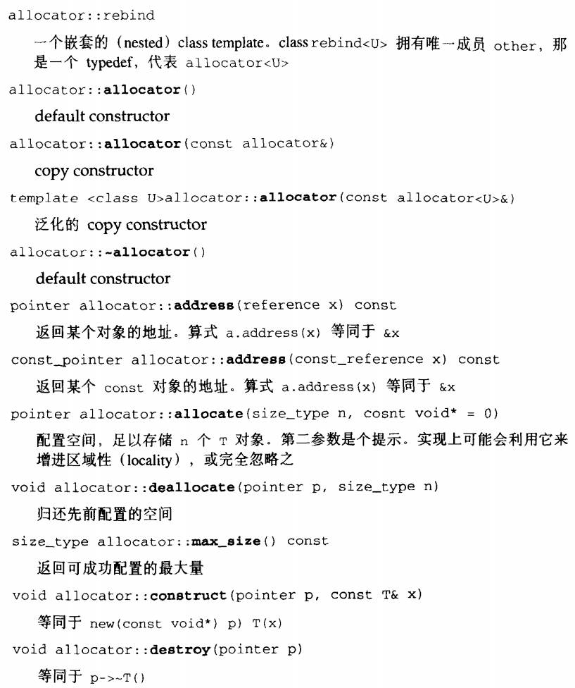

# STL六大组件综述

**contianer**：容器，一种class template

**algorithm**：算法，一种function template

**任何一个算法所标识的区间都是一个前闭后开的区间**

**iterator**：迭代器，泛型指针，主要对operator*，operator->，operator++，operator--进行了重载，是一种class template

**functor**：仿函数，一种重载了operator()的class或class template

<a href="./code/easy_functor.cpp">一个简易的functor实例</a>

**adapter**：配接器，用来修饰container或functor或iterator接口的东西

**allocator**：配置器，负责空间配置和管理

# 空间配置器——Allocator

## Allocator的必要接口




## 一般设计的allocator

1.   allocator主要是对operator new和operator delete的包装
2.   allocate负责内存配置，deallocate负责内存释放。construct负责构造对象，destory负责对象析构

## new和delete的原理

### new

1.   调用::operator new配置内存
2.   调用构造函数构造对象内容

### delete

1.   调用析构函数
2.   调用operator delete释放内存

## SGI的分配器

SGI没有使用标准的STL分配器，而是自己书写的Alloc分配器


### 对象的构造与析构——construct()和destory()


#### __destory函数

判断是否拥有trivial destructor（默认构造函数），如果没有说明应该存在一些手动的内存释放，需要调用destory函数

```C++
// 判斷元素的數值型別（value type）是否有 trivial destructor
template <class ForwardIterator, class T>
inline void __destroy(ForwardIterator first, ForwardIterator last, T*) 
{
	typedef typename __type_traits<T>::has_trivial_destructor trivial_destructor; 
  	__destroy_aux(first, last, trivial_destructor());
}
// 如果元素的數值型別（value type）有 non-trivial destructor…
template <class ForwardIterator> inline void
__destroy_aux(ForwardIterator first, ForwardIterator last, __false_type) 
{   
    for ( ; first < last; ++first)
        destroy(&*first); 
}
// 如果元素的數值型別（value type）有 trivial destructor…
template <class ForwardIterator>
inline void __destroy_aux(ForwardIterator, ForwardIterator, __true_type) {}
```

使用trivial destructor的元素在使用destory函数（传入首位迭代器的版本）是并没有调用析构函数，因为如果这个范围很大，调用多次析构函数效率很低。

### 空间的配置与释放——std::alloc

考虑到小型区块可能造成内存破碎问题，SGI设计了双层级配置器。

第一级 配置器直接使用 malloc() 和 free()，

第二级配置器则视情况采用不同的策略： 当配置区块超过 128bytes，视之为**「足够大」**，便呼叫**第一级配置器**；当配置区 块小于 128bytes，视之为**「过小」**，为了降低额外负担， 便采用复杂的 **memory pool **整理方式，而不再求助于第一级配置器。

其中\_\_malloc_alloc_template 就是第一级配置器，\_\_default_alloc_ template 就是第二级配置器。


#### 第一级配置器 __malloc_alloc_template

**<a herf="./code/第一级配置器剖析.cpp" title='第一级配置器剖析'><u>第一级配置器剖析代码</u></a>**

第一级配置器使用了malloc()，free()，realloc()来执行内存的配置，释放和重配置。实现了类似C++ new-handler机制

所谓C++ new handler机制是，你可以要求系统在内存配置需求无法被满足时，调用一个你所指定的函数。换句话说，一旦::operator new无法完成任务，在丢出std::bad_alloc异常状态之前，会先调用由客端指定的处理例程。该处理例程通常即被称为new-handler。


