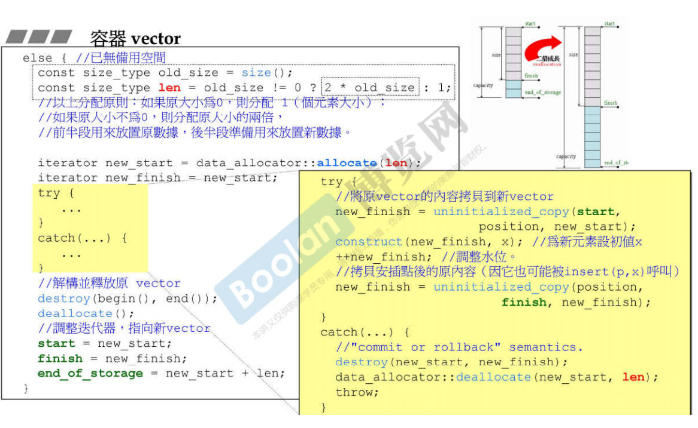
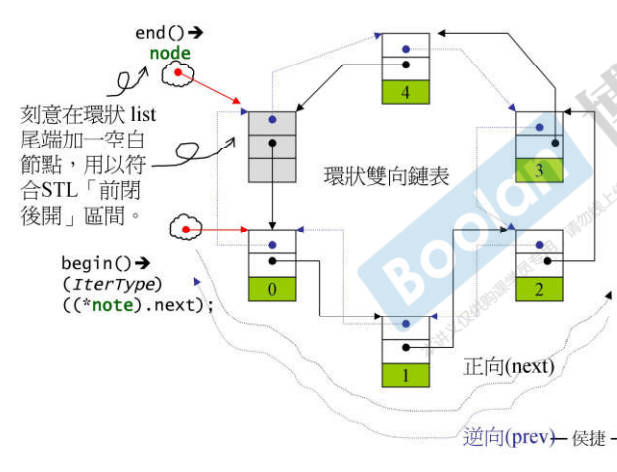
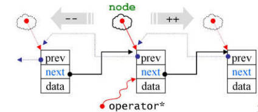

# STL六大组件综述

**contianer**：容器，一种class template

**algorithm**：算法，一种function template

**任何一个算法所标识的区间都是一个前闭后开的区间**

**iterator**：迭代器，泛型指针，主要对operator*，operator->，operator++，operator--进行了重载，是一种class template

**functor**：仿函数，一种重载了operator()的class或class template

<a href="./code/easy_functor.cpp">一个简易的functor实例</a>

**adapter**：配接器，用来修饰container或functor或iterator接口的东西

**allocator**：配置器，负责空间配置和管理

# 空间配置器——Allocator

## Allocator的必要接口


## 一般设计的allocator

1.   allocator主要是对operator new和operator delete的包装
2.   allocate负责内存配置，deallocate负责内存释放。construct负责构造对象，destory负责对象析构

## new和delete的原理

### new

1.   调用::operator new配置内存
2.   调用构造函数构造对象内容

### delete

1.   调用析构函数
2.   调用operator delete释放内存

## SGI的分配器

SGI没有使用标准的STL分配器，而是自己书写的Alloc分配器


### 对象的构造与析构——construct()和destory()


#### __destory函数

判断是否拥有trivial destructor（默认构造函数），如果没有说明应该存在一些手动的内存释放，需要调用destory函数

```C++
// 判斷元素的數值型別（value type）是否有 trivial destructor
template <class ForwardIterator, class T>
inline void __destroy(ForwardIterator first, ForwardIterator last, T*) 
{
	typedef typename __type_traits<T>::has_trivial_destructor trivial_destructor; 
  	__destroy_aux(first, last, trivial_destructor());
}
// 如果元素的數值型別（value type）有 non-trivial destructor…
template <class ForwardIterator> inline void
__destroy_aux(ForwardIterator first, ForwardIterator last, __false_type) 
{   
    for ( ; first < last; ++first)
        destroy(&*first); 
}
// 如果元素的數值型別（value type）有 trivial destructor…
template <class ForwardIterator>
inline void __destroy_aux(ForwardIterator, ForwardIterator, __true_type) {}
```

使用trivial destructor的元素在使用destory函数（传入首位迭代器的版本）是并没有调用析构函数，因为如果这个范围很大，调用多次析构函数效率很低。

### 空间的配置与释放——std::alloc

考虑到小型区块可能造成内存破碎问题，SGI设计了双层级配置器。

第一级 配置器直接使用 malloc() 和 free()，

第二级配置器则视情况采用不同的策略： 当配置区块超过 128bytes，视之为**「足够大」**，便呼叫**第一级配置器**；当配置区 块小于 128bytes，视之为**「过小」**，为了降低额外负担， 便采用复杂的 **memory pool **整理方式，而不再求助于第一级配置器。

其中\_\_malloc_alloc_template 就是第一级配置器，\_\_default_alloc_ template 就是第二级配置器。


### 第一级配置器 __malloc_alloc_template

**<a href="./code/第一级配置器剖析.cpp">第一级配置器剖析代码</a>**

第一级配置器使用了malloc()，free()，realloc()来执行内存的配置，释放和重配置。实现了类似C++ new-handler机制

所谓C++ new handler机制是，你可以要求系统在内存配置需求无法被满足时，调用一个你所指定的函数。换句话说，一旦::operator new无法完成任务，在丢出std::bad_alloc异常状态之前，会先调用由客端指定的处理例程。该处理例程通常即被称为new-handler。

### 第二级配置器 __deafault_alloc_template

区块小于128bytes时，就使用内存池管理。第二级配置器将小额区块上调至8的倍数，并维护16个free-lists，各自管理大小为8*n(1~16)的小额区块。

free-lists使用union以共享空间

```C++
union obj{
    union obj* free_list_link;
    char client_data[1];	// the client see this.
}
```


**<a href="./code/第二级配置器剖析.cpp">第二级配置器剖析代码</a>**

#### 空间配置函数allocate()

```C++
  static void *allocate(size_t n) {
    obj *__VOLATILE *my_free_list;
    obj *__RESTRICT result;

    // 首先，函数会判断n是否大于__MAX_BYTES，如果大于，则调用malloc_alloc的allocate函数来分配内存空间，并返回结果。

    if (n > (size_t)__MAX_BYTES) {
      return (malloc_alloc::allocate(n));
    }

    // 如果n小于等于__MAX_BYTES，则会根据n的大小计算出一个索引值，然后将free_list数组中对应索引位置的指针赋值给my_free_list。
    my_free_list = free_list + FREELIST_INDEX(n);

    // 然后，函数会将my_free_list指针指向的对象赋值给result。如果result为0，则表示对应的free_list链表为空，这时会调用refill函数来重新填充空间，并返回结果。
    result = *my_free_list;
    if (result == 0) {
      void *r = refill(ROUND_UP(n));
      return r;
    }
    // 最后，如果free_list链表不为空，则将result指针指向的对象从链表中取出，并将其下一个节点赋值给my_free_list指针。 
    *my_free_list = result->free_list_link;
    return (result);
  };
```


#### 空间释放函数deallocate()

```C++
  /* p may not be 0 */
  static void deallocate(void *p, size_t n) {
    obj *q = (obj *)p;
    obj *__VOLATILE *my_free_list;
    // 如果n大于最大字节数__MAX_BYTES，则调用malloc_alloc的deallocate函数释放内存，并返回。
    if (n > (size_t)__MAX_BYTES) {
      malloc_alloc::deallocate(p, n);
      return;
    }
    // 根据n的大小计算出对应的自由链表索引，将my_free_list指向对应的自由链表。
    my_free_list = free_list + FREELIST_INDEX(n);
    // 将q插入到自由链表中，即将q的free_list_link指向当前自由链表的头节点，然后将my_free_list指向q。
      //调整freelist，回收区块
    q->free_list_link = *my_free_list;
    *my_free_list = q;
  }
```


#### 重新填充free lists——refill()

```C++
template <bool threads, int inst>
void *__default_alloc_template<threads, inst>::refill(size_t n) {
  // 需要分配的内存块数量
  int nobjs = 20;
  char *chunk = chunk_alloc(n, nobjs);
  obj *__VOLATILE *my_free_list;
  obj *result;
  obj *current_obj, *next_obj;
  int i;
  // 如果只获得一个区块，这个区块就分配给调用者用，free list无新节点
  if (1 == nobjs)
    return (chunk);
  // 否则准备调整free list，纳入新节点
  my_free_list = free_list + FREELIST_INDEX(n);

  /* Build free list in chunk */
  result = (obj *)chunk;
  // 以下导引free list指向新配置的空间
  *my_free_list = next_obj = (obj *)(chunk + n);
  // 将free list中的节点串接起来，形成一个链表
  for (i = 1;; i++) {
    current_obj = next_obj;
    next_obj = (obj *)((char *)next_obj + n);
    if (nobjs - 1 == i) {
      current_obj->free_list_link = 0;
      break;
    } else {
      current_obj->free_list_link = next_obj;
    }
  }
  return (result);
}
```

#### 从内存池取得空间——chunk_alloc()

```C++
template <bool threads, int inst>
char *__default_alloc_template<threads, inst>::chunk_alloc(size_t size, int &nobjs)
{
  char *result;
  // 计算需要分配的总字节数
  size_t total_bytes = size * nobjs;
  // 计算剩余可用内存的字节数
  size_t bytes_left = end_free - start_free;

  if (bytes_left >= total_bytes)
  {
    // 内存池剩余空间完全满足需求量
    result = start_free;
    start_free += total_bytes;
    return (result);
  }
  else if (bytes_left >= size)
  {
    // 内存池足够分配一个及以上的区块
    nobjs = bytes_left / size; // 重新计算nobjs，看能分配多少区块
    total_bytes = size * nobjs;
    result = start_free;
    start_free += total_bytes;
    return (result);
  }
  else
  {
    // 内存池空间连一个区块大小都无法提供
    size_t bytes_to_get = 2 * total_bytes + ROUND_UP(heap_size >> 4);
    // Try to make use of the left-over piece.
    // 发挥内存池剩余零头空间的剩余价值
    if (bytes_left > 0)
    {
      // 内存池剩下的零头先分配给free list
      // 首先寻找合适的free list
      obj *__VOLATILE *my_free_list = free_list + FREELIST_INDEX(bytes_left);

      // 调整free list，将内存池的剩余空间编入
      ((obj *)start_free)->free_list_link = *my_free_list;
      *my_free_list = (obj *)start_free;
    }

    // 调用malloc函数获取更多的内存以扩充内存池，配置heap空间
    start_free = (char *)malloc(bytes_to_get);
    if (0 == start_free)
    {
      // heap空间不足，malloc失败
      int i;
      obj *__VOLATILE *my_free_list, *p;
      // Try to make do with what we have.  That can't hurt.  We do not try smaller requests, since that tends to result in disaster on multi-process machines.
      // 尝试检视我们手上的东西，这不会造成伤害。我们不会尝试配置更小的区块，因为这将在多线程机器上造成灾难

      // 以下搜寻适当的free list，即尚有未用区块且区块够大的free list
      for (i = size; i <= __MAX_BYTES; i += __ALIGN)
      {
        my_free_list = free_list + FREELIST_INDEX(i);
        p = *my_free_list;
        // 如果有未用区块，调整free list以释放出来
        if (0 != p)
        {
          *my_free_list = p->free_list_link;
          start_free = (char *)p;
          end_free = start_free + i;
          return (chunk_alloc(size, nobjs));
          // 递归调用自己修正nobjs
          //  Any leftover piece will eventually make it to the
          //  right free list.
        }
      }
      end_free = 0;                                              // In case of exception.
      start_free = (char *)malloc_alloc::allocate(bytes_to_get); // 最后的希望——out-of-memory机制
      // This should either throw an exception or remedy the situation.  Thus we assume it succeeded.
      // 这应该抛出异常或纠正这种情况。因此，我们假定它成功了
    }
    heap_size += bytes_to_get;
    end_free = start_free + bytes_to_get;
    // 递归调用自己修正nobjs
    return (chunk_alloc(size, nobjs));
  }
}
```


假设一开始调用chunk_alloc(32,20)，malloc()配置40个32bytes区块，第一个传回给客端，剩下19个交给free_list[3]维护，余下20个给内存池。

当再次调用chunk_alloc(64,20)时，free_list[7]空空如也，需要向内存池要求支持。内存池返回10个区块，一个交给客端，余下9个交给free_listy[7]维护。

再次调用chunk_alloc(96,20)，内存池也空了，需要用malloc配置新的区块扩充内存池

## 内存基本处理工具

####uninitialized_copy

```C++
template <class InputIterator, class ForwardIterator> ForwardIterator 
uninitialized_copy(InputIterator first, InputIterator last,ForwardIterator result);
```

针对输入范围内每个迭代器i，此函数会呼叫construct，产生\*i的复制品

uninitialized_copy使得我们能够将内存的配置和对象构造行为分开来

#### uninitialized_fill

```C++
template <class ForwardIterator, class T>
void uninitialized_fill(ForwardIterator first, ForwardIterator last,const T& x);
```

uninitialized_fill会针对操作范围内的每个迭代器i ,调用construct(&*i, x),    在i所指之处产生x的复制品

#### uninitialized_fill_n

```C++
template <class ForwardIterator, class Size, class T> ForwardIterator
uninitialized_fill_n(ForwardIterator first, Size n, const T& x);
```

同上，为指定范围内的所有元素设定处置，调用copy constructor


**三个记忆基本函数的泛型版本与特化版本**

# 迭代器——iterator

## 迭代器是一种智能指针 smart pointer

迭代器最重要的工作时重载operator*和operator->

## Traits编程技法

迭代器所指对象的型别，称为该迭代器的value type,上述的参数型别推导 技巧虽然可用于value type,却非全面可用：万一 value type必须用于函数的传回值，就束手无策了。

此时我们可以声明内嵌型别（type）

```C++
template <class I, class T>
void func_impl(I iter, T t)
{
  T tmp; // 這裡解決了問題。T 就是迭代器所指之物的型別
  // ... 這裡做原本 func() 應該做的全部工作
};
template <class I>
inline void func(I iter)
{
  func_impl(iter, *iter); // func 的工作全部移func_impl
}
int main()
{
  int i;
  func(&i);
}
```

注意func()的返回类型前必须加上关键字typename，因为T是一个template参数。这样的用意在于告诉编译器这是一个type，才可顺利通过编译

**但是，并不是所有的迭代器都是class type，比如指针**

此时就需要使用template partial specialization（偏特化）了

那么如何区分不同的iterator？

**使用iterator_traits**来萃取迭代器的特性，而value type正是迭代器的特性之一

```C++
template <class I>
struct iterator_traits{
    typedef typename I::value_type value_type;
};
```

这个所谓的 traits，其意义是，如果 I 定义有自己的value type，那么通过 这个traits的作用，萃取出来的value_type就是 I:value_type 。

之前的func()可以进行以下改写

```C++
template <class I>
typename iterator_traits<I>::value_type  // 這一整行是函式回返型別 
func(I ite)
{ return *ite; }
```

这样可以写一个traits的特化版本

```C++
template <class T>
struct iterator_traits<T*>{
    typedef T value_type;
};
```


常见的物种迭代器相应类型：**value type，difference type，pointer，reference，iterator catagory**

### value type

即迭代器所指对象的型别

任何一个与STL算法搭配的class，都应该定义自己的value type内嵌型别

### difference type

两个迭代器之间的距离，也可以表示一个容器的最大容量。

如果是连续空间容器，头尾距离就是其最大容量。

比如STL的count()

```C++
template<class I,class T>
typename iterator_traits<I>::difference_type
count(I first, I last, const T& value){
    typename iterator_traits<I>::difference_type = 0;
    for(; first != last; ++first)
        if(*first == value)
            ++n;
    return n;
}
```

除此之外也有针对原生指针和原生pointer-to-const的偏特化版本

### reference type

从“迭代器所指之物能否允许改变”的角度，分为constant iterator和mutable iterator。

当我们对一个mutable iterator进行提领操作时，获得的应该是一个左值而不是右值，右值不允许赋值操作。


传回左值都以by reference的方式进行。

所以p是个**mutable iterator**时，value type为T，**\*p的型别应该是T&**

p是个**constantiterator**时，value type为T，**\*p的型别应该是const T&**

### pointer type

同上，传回的时T\*或者const T\*

### iterator_category

**input iterator**： read only只读

**output iterator**：write noly只写

**forward iterator**：允许写入型算法在此种迭代器形成的区间操作（*operator++*）

**bidirectional iterator**：可双向移动，某些算法需要你想走访某个迭代器区间（*operator--*）

**random access iterator**：前四种都只供应一部分指针算术能力，第五种涵盖所有，随机寻址


```C++
struct input_iterator_tag {};
struct output_iterator_tag {};
struct forward_iterator_tag :public input_iterator_tag{};
struct bidirectional_iterator_tag :public forward_iterator_tag{};
struct random_access_iterator_tag :public bidirectional_iterator_tag{};
```

**注意：原生指针和原生pointer-to-const是random access iterator**

## Iterator源代码

**<a href="./code/Iterator源码节选.cpp">Iterator源码节选</a>**

## __type_traits

\_\_type\_traits关注这个型别是否具备**non-trivial default ctor**？是否具备**non-trivial copy ctor**？是否具备**non-trivial assignment operator**？是否具备**non-trivial  dtor**？是不是**POD**类型？


上述式子应该传回对象，且表示真假，所以传回的内容如下

```C++
struct __true_type{};
struct __false_type{}
```

# 序列式容器——sequence containers

序列式容器指所有元素都ordered，但未必sorted

## vector

与array相比，vector对空间运用更灵活，是动态空间

扩充方式：每次size==capacity时，就会进行扩充，扩充后的大小为原来的两倍

**<a href="./code/vector定义.cpp">vector定义</a>**

vector的迭代器是random access iterator


### push_back




### erase


### insert

```c++
template<class T, class Alloc>
void vector<T, Alloc>::insert(iterator position, size_type n, const T& x)
{
  if (n != 0) {		// n != 0时进行以下操作
    if (size_type(end_of_storage - finish) >= n) {
        //备用空间大于等于新增的元素个数
      T x_copy = x;
        //计算插入点之后现有的元素个数
      const size_type elems_after = finish - position;
      iterator old_finish = finish;
      if (elems_after > n) {
          //插入点之后的现有元素个数 大于 新增元素个数
        uninitialized_copy(finish - n, finish, finish);
        finish += n;
        copy_backward(position, old_finish - n, old_finish);
        fill(position, position + n, x_copy);
      } else {
          //插入点之后的现有元素个数 小于等于 新增元素个数
        uninitialized_fill_n(finish, n - elems_after, x_copy);
        finish += n - elems_after;
        uninitialized_copy(position, old_finish, finish);
        finish += elems_after;
        fill(position, old_finish, x_copy);
      }
    } else {
        //备用空间小于 新增元素个数
        //首先决定新长度，两倍或者旧加新
      const size_type old_size = size();
      const size_type len = old_size + max(old_size, n);
      iterator new_start = data_allocator::allocate(len);
      iterator new_finish = new_start;
      __STL_TRY
      {
          //先将就vector插入点之前的元素复制进去
        new_finish = uninitialized_copy(start, position, new_start);
          //再将新加的元素填入新空间
        new_finish = uninitialized_fill_n(new_finish, n, x);
          //再将旧vector的插入点之后的元素复制到新空间
        new_finish = uninitialized_copy(position, finish, new_finish);
      }
#ifdef __STL_USE_EXCEPTIONS
      catch (...)
      {
          //如有异常，实现commit or rollback
        destroy(new_start, new_finish);
        data_allocator::deallocate(new_start, len);
        throw;
      }
#endif /* __STL_USE_EXCEPTIONS */
        
        //清除并释放旧的vector
      destroy(start, finish);
      deallocate();
      start = new_start;
      finish = new_finish;
      end_of_storage = new_start + len;
    }
  }
}
```


## list

双向链表



### node

```C++
template <class T>
struct __list_node{
    typedef void* void_pointer;
    void_pointer prev;			//型别为void*，其实可设为__list_node<T>*
    void_pointer next;
    T data;
}
```

### iterator

前移和后移，所以是bidirectional iterator

关于operator*和operator->的设计

```C++
reference operator*() const {return (*node).data;}
pointer operator->() const {return &(operator*);}
```



### list的内存和构造管理

```C++
void empty_initialize(){
    node = get_node();
    node->next = node;
    node->prev = node;
}
//构造一个空链表，只有头节点
```

### list的元素操作

push_front，push_back，erase，pop_front，pop_back，clear，remove

#### unique

移除数值相同的连续元素

#### transfer

迁移操作，将某连续范围的元素迁移到某个特定位置之前，这个操作为后来的splice，sort，merge等打下了良好的基础。

```c++
protected:
  void transfer(iterator position, iterator first, iterator last) {
    if (position != last) {
      (*(link_type((*last.node).prev))).next = position.node;
      (*(link_type((*first.node).prev))).next = last.node;
      (*(link_type((*position.node).prev))).next = first.node;  
      link_type tmp = link_type((*position.node).prev);
      (*position.node).prev = (*last.node).prev;
      (*last.node).prev = (*first.node).prev; 
      (*first.node).prev = tmp;
    }
  }
```


#### 其他操作

splice：接合

reverse：反转

sort：排序

merge：合并（已排序）

## deque

双向开口


deque实现连续的方式是分段连续，含有一个控制中心和对于每一段的迭代器，迭代器前往下一个时必须检查是不是这一段的最后一个数据，如果是的话就需要回到控制中心找到下一段的开头

### deque的中控器

如上图所示，deque采用一小块map作为主控，这是一小块连续空间，每个元素（node）都是指针，指向另一端较大的连续空间，叫做缓冲区。

```C++
template<class T,class Alloc = alloc,size_t Bufsiz = 0>
class deque{
    public:
    ...
    protected:
    typedef pointer* map_pointer;
    //元素的指针的指针
    
    map_pointer map;	//指向map，map是一块连续空间
    size_type map_size; //map可容纳多少指针
}
```

### deque的迭代器

deque的迭代器没有继承std::iterator

```C++
template <class T, class Ref, class Ptr, size_t BufSiz>
struct __deque_iterator {
  typedef __deque_iterator<T, T&, T*, BufSiz>             iterator;
  typedef __deque_iterator<T, const T&, const T*, BufSiz> const_iterator;
  static size_t buffer_size() {return __deque_buf_size(BufSiz, sizeof(T));}
    
  typedef random_access_iterator_tag iterator_category;
  typedef T value_type;
  typedef Ptr pointer;
  typedef Ref reference;
  typedef size_t size_type;
  typedef ptrdiff_t difference_type;
  typedef T** map_pointer;

  typedef __deque_iterator self;

  T* cur;
  T* first;
  T* last;
  map_pointer node;
}
```


```C++
reference operator*() const{return *cur;}
pointer operator->() const {return &(operator*());}

difference_type operator-(const self& x) const{
    return difference_type(buffer_size()) * (node - x.node - 1) + (cur - first) + (x.last - x.cur);
}

// 每一段buffer的大小 * 首尾buffer之间的数量(减1是因为首个缓冲区需要去掉) + 首尾两个缓冲区的大小

self& operator++(){
    ++cur;
    if(cur == last){
        set_node(node+1);
        cur = first;
    }
    return *this;
}

self operator++(int){
    self tmp = *this;
    ++*this;
    return tmp;
}

self& operator--(){
    if(cur == first){
        set_node(node-1);
        cur = last;
    }
    --cur; 
    return *this;
}

self operator--(int){
    self tmp = *this;
    --*this;
    return tmp;
}

self& operator+=(difference_type n){
    difference_type offset = n + (cur - first);
    //判断目标位置在不在同一缓冲区内
    if(offset >= 0 && offset < difference_type(buffer_size()))
        cur += n;
    else{
        difference_type node_offset = offset > 0 ? offset / difference_type(buffer_size()) : -difference_type((-offset - 1) / buffer_size()) - 1;
        //切换至正确的缓冲区
        set_node(node + node_offset);
        //切换至正确的元素
        cur = first + (offset - node_offset * difference_type(buffer_size()));
    }
    return *this;
}

self operator+(difference_type n) const{
    self tmp = *this;
    return tmp += n;
}

self& operator-=(difference_type n){return *this += -n;}

self operator-(difference_type n)const{
    self tmp = *this;
    return tmp -= n;
}

reference operator[](difference_type n) const{return *(*this + n);}
```

### deque的空间配置器

deque有两个专属的配置器（allocator），一个每次配置一个元素大小（value_type），一个每次配置一个指针大小（pointer）。

constructor调用fill_initialize()，fill_initialize()中调用了create_map_and_nodes,负责产生和安排好deque的结构

```C++
template <class T, class Alloc, size_t BufSize>
void deque<T, Alloc, BufSize>::create_map_and_nodes(size_type num_elements) {
    //需要节点数=（元素个数/每个缓冲区可容纳的元素个数）+ 1
    //如果刚好整除会多配一个节点
  size_type num_nodes = num_elements / buffer_size() + 1;
	// 一个map要管理几个节点。最少8个，最多是“所需节点数加2"
  map_size = max(initial_map_size(), num_nodes + 2);
  map = map_allocator::allocate(map_size);
	//以下令nstart和nfinish指向map所拥有之全部节点的最中央区段 
    //保持在最中央，可使头尾两端的扩充能量一样大.每个节点可对应一个缓冲区
  map_pointer nstart = map + (map_size - num_nodes) / 2;
  map_pointer nfinish = nstart + num_nodes - 1;
    
  map_pointer cur;
  __STL_TRY {
      //为map内的每个现用节点配置缓冲区。所有缓冲区加起来就是deque的可用空间(最后一个缓冲区可能留有一些余裕)
    for (cur = nstart; cur <= nfinish; ++cur)
      *cur = allocate_node();
  }
    
#     ifdef  __STL_USE_EXCEPTIONS 
  catch(...) {
      // "commit or rollback"
    for (map_pointer n = nstart; n < cur; ++n)
      deallocate_node(*n);
    map_allocator::deallocate(map, map_size);
    throw;
  }
#     endif /* __STL_USE_EXCEPTIONS */

  start.set_node(nstart);
  finish.set_node(nfinish);
  start.cur = start.first;
  finish.cur = finish.first + num_elements % buffer_size();
}
```


### push_back和push_front

```C++
void push_back(const value_type& t){
    if(finish.cur != finish.last - 1){
        construct(finish.cur, t);
        ++finish.cur;
    }
    else 
        push_back_aux(t);
}
```

尾端只剩一个备用空间时，调用push_back_aux()

```C++
template<class T,class Alloc, size_t BufSize>
void deque<T, Alloc, BufSize>::push_back_aux(const value_type& t){
    value_type t_copy = t;
    reserve_map_at_back();	//若符合某个条件就必须换一个map
    *（finish.node + 1) = allocate_node();
    __STL_TRY{
        construct(finish.cur, t_copy);
        finish.set_node(finish.node + 1);
        finish.cur = finish.first;
    }
    __STL_UNWIND(deallocate_node(*(finishj.node + 1)));
}
```

push_front与此类似

## stack

栈，先进后出，FILO

底层容器deque

push：push_back()

pop：pop_back()

**可以使用list作为stack的底层容器**

## queue

队列，先进先出，FIFO

**可以使用list作为queue的底层容器**

## heap

heap是priority queue的底层机制

binary heap：一种complete binary tree，所以使用array实现

### push_heap

先将新值放到底部在调整位置，和根节点比较并决定是否与根节点交换

```c++
template <class RandomAccessIterator, class Distance, class T>
void __push_heap(RandomAccessIterator first, Distance holeIndex, Distance topIndex, T value){
    Distance parent = (holeIndex - 1) / 2;//找出父节点
    while(holeIndex > topIndex && *(first + parent) < value){
        //当尚未到达顶端，且父节点小于新值，两个交换
        *(first + holeIndex) = *(first + parent);
        holeIndex = parent;
        parent = (holeIndex - 1) / 2;
    }	//持续至顶端，或满足heap的特性为止
    *(first + holeIndex) = value;
}
```

### pop_heap

取走根节点，最后节点移至根节点，再进行交换调整

### sort_heap

不断对heap进行pop操作，以达到排序效果

```C++
template<class RandomAccessIterator>
void sort_heap (RandomAccessIterator first, RandomAccessIterator last){
    while(last - first > 1)
        pop_heap(first, last--);	//每执行一次 pop_heap，操作返回回退一格
}
```


### make_heap

将现有的数据转化为heap，传入迭代器头尾，distance和value_type

```C++
template <class RandomAccessIterator, class Compare, class T, class Distance>
void __make_heap(RandomAccessIterator first, RandomAccessIterator last, Compare comp, T*, Distance*) {
    // 如果长度为0或1，不必重新排列
  if (last - first < 2) return;
    //找出第一个需要重排的子树头部，以parent标示出。由于任何叶节点都不需执行
    // perlocate down,所以有以下计算。parent命名不佳，名为holelndex更好
  Distance len = last - first;
  Distance parent = (len - 2)/2;
    
  while (true) {
      // 重排以parent 为首的子树，len是为了让__adjust_heap()判断操作范围
    __adjust_heap(first, parent, len, T(*(first + parent)), comp);
    if (parent == 0) return;	//走完根节点就结束
    parent--;					//即将重排的子树头部向前一个节点
  }
}
```

## priority_queue

默认的priority queue由一个max-heap完成。


而heap是使用vector完成的，所以priority queue的底层容器是vector。

priority queue有默认的比较方式，即max-heap

```C++
template<class T,class Sequence = vector<T>, class Compare = less<typename Sequence::value_type> >
class priority_queue{
    protected:
    Sequence c;		//底层容器
    Compare comp;	//元素大小比较标准
    
}
```

